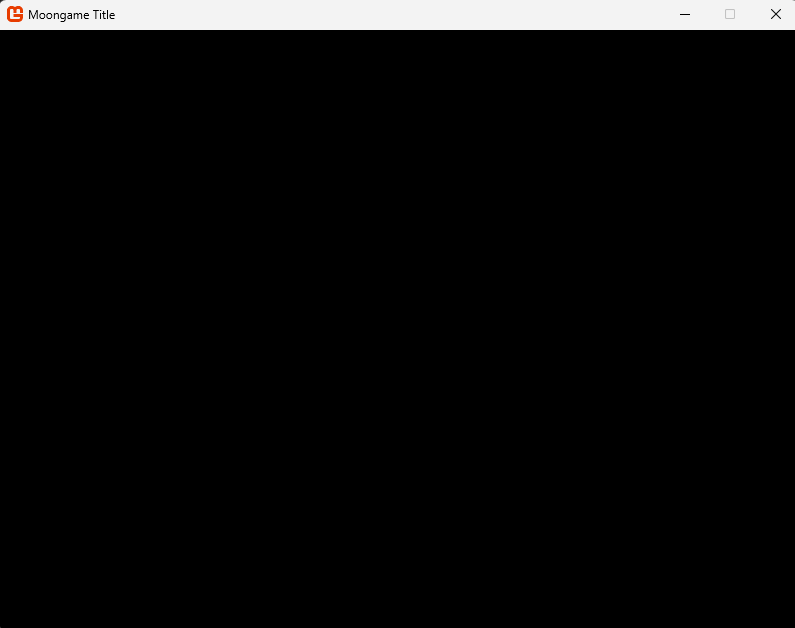

Все, что нужно для того, чтобы начать разрабатывать игру, это создать новый проект C# (желательно использовать шаблон с Monogame) и в классе Program объявить новый экземпляр класса `App`.

`App` принимает в себя путь до папки с контентом (там, где вы будете хранить спрайты, звуки и прочие ассеты игры).

Далее нужно вызвать метод `Run` и вы увидите окно.



Код данного примера

```csharp
using System.IO;
using GameEngine;

var currentDirectory = Directory.GetCurrentDirectory();
var absolutePath = Path.GetFullPath(Path.Combine(currentDirectory, "Content"));

var app = new App(absolutePath);

app.Run();
```
